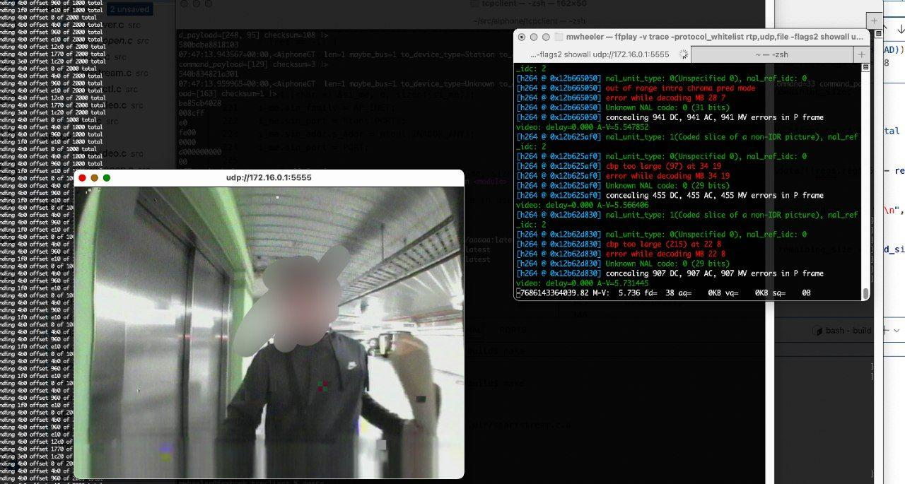

This repo contains a selection of tools and documentation for reverse engineering and modifying Aiphone GT series firmware.

### Security concerns
- The GT-MCX has [hardcoded SSH credentials](#default-security-codes) for firmware updates
- Passcodes for configuring the device are limited to 4 numbers and often the [defaults](#default-security-codes) are set. It's possible to [brute force them](https://github.com/palmerc/Tora) older hardware that [hasn't been physically replaced](https://nvd.nist.gov/vuln/detail/CVE-2022-40903).
- GT-1C7W firmware update process uses a [private key stored on the device](#rooting) to validate the firmware
- The GT-MCX doesn't have firmware signing
- The same bus that is in all the apartments contains entrances and can be used to reprogram devices remotely
- The bus is not authenticated or signed in anyway. You can impersonate any user on the bus. Gateway logs will show another tenant performing an action
- Entrances can be reprogrammed from the front panel keypad or NFC
- Apart from the GT-1C7W and GT-MCX - devices cannot be firmware upgraded. Physical replacement required for security fixes
- NFC functionality just uses the card ID. Magic mifares can emulate the card ID. The card type is not recorded allowing for downgrading of card types.
- The GT-MCX multi building system only uses TLS for limited functions, and where it does it doesn't check TLS certificates are valid or perform authentication
- All the bad things that come with a shared bus - listening in on conversations, watching entrances/calls, impersonating users, logging actions. All conveniently installed into your apartment. Denial of service, either by sending bad packets or by just pulling the bus.
- The WiFi app feature of the Aiphone GT / GT-1WC7 lets you connect the intercom to your mobile phone. This feature uses an [insecure configuration of AWS IoT](https://cloudisland.nz/@xssfox/115242415791116190) which both reveals IP addresses and configuration data of all intercoms connected, but also likely allows listening in, intercepting or messing with other peoples devices. 
- The firmware updates for the GT-1C7W are diffs. This means its impossible to restore the device to a factory config. I could modify one with malicious backdoor and sell it on eBay
- I haven't tested this as I don't have hardware but my vibe is that it might be possible to trigger intercoms to think they are in a call state without them ringing first. This would allow listening in on an apartment. This is speculation as I don't have enough of my own hardware to test this.

### Official resources
- [Firmware and system manuals](https://www.aiphone.net/support/software-documents/gt/)
- [Technical specifications and knowledge base](https://www.aiphone.com/kbtopic/gt-series/)
- [Android App for NFC reprogramming](https://play.google.com/store/apps/details?id=jp.co.aiphone.ngt_android_setting_tool&hl=en_AU&pli=1)

### Default security codes
Many of the Aiphone GT series entrances and devices can be reprogrammed (even from the insecure side) via NFC Android app, by IP, or from the front panel.

```
Admin: *1111
Manager: #2222
```

The GT-1C7W has a secret configuration menu, under "other settings 2/2". Press and hold the right empty button for 2 or more seconds.[^2]

The GT-MCX firmware is actually a zip file. The password is `aiphoneGTMCXFW`. The SSH username and password for uploading the firmware is hardcoded as `sftp-gt` and `aiphoneGTadmin`

### Bus Protocol
#### Physical
The system appears to use a floating 24v system. The system is not intended to be grounded[^1]. The system is compromised of 2 wires for audio/comms/power (R1 R2) and optionally 2 wires for video.

Units can be wired either as a "loop" where each apartment/intercom/entrance is hanging off the output of another unit. This doesn't actually form a loop topology, just a long daisy chain.

Or units can be wired as "home run" where each intercom/entrance comes back to a single distribution point. 

There are standard, expanded and multi building configurations. In a standard system you can have entrances call residents stations directly without any additional supporting hardware, while extended systems have bus control units / expanded bus control units (GT-BCXB-N). In multi building configuration an IP gateway (GT-MCX) emulates some of the functions of an entrance and guard station which allows for bridging between various sections using IP.

As the system works as buses, it's very likely that the apartment intercom unit has access to view, listen and see other apartments and entrances, even when that apartment hasn't been called.

The protocol is RS-232, with 12v indicating space and 24v indicating a mark. Interfacing with this is easiest done in software using a GT-1C7W, however I did have some luck reading off the bus using two different methods:
 - Oscilloscope differencing the pairs (remember not to ground the signal)
 - A galvanically isolated RS-232 to ethernet gateway + an adjustable voltage regulator which allowed creating a virtual ground at 18v.

#### RS-232 configuration
- 9600 baud
- 8 data bits
- 1 stop bit
- even parity

#### Protocol
This is still WIP, but so far this is what I have gathered

```
to      from    cmd    parameters   checksum
8f 01   0c 01   b0     00 58        xx
```

The first nibble of the `to` field determines the length of the packet. It seems that the first byte of the `to`/`from contains the type of device (entrance, guard,...) while the second byte contains the address.

Various commands exist, and not full documented. Commands might be different across device types / modes.

```
0x13 ping?
0x06 ack
0x24 line free - hang up
0x20 can haz line
0x26 can haz line plz
0x82 unlock
0x83 unlock
0xb0 lift control
0x40 (to 0f01 - open line?)
0x29 (to 0f01 - open line?)
0x86 monitor station
0x11 system info?
0x12 system info?

0x70 call no camera
0x71 call with camera
0x72 call no camera
0x73 call with camera
0x74 emergency call

0x79 call ok? 

0x87 mon ok
0x89 end mon
0x8a ng mon
0xe1 ptz info
0xe3 camera control info

0xf4 check if can call this address?
0xf1 set address
0xf2 set address
0xf3 set address

0xf0 the response for gateway call

0xfd call other adddress?
0xfb call other adddress?

```

##### Checksum
```python
def chk(inputbytes: bytes):
    chksum = 0
    for x in inputbytes:
        chksum += x
        if chksum > 256:
            chksum = chksum - 256
    chksum = 256 - chksum
    return  chksum
```

#### Authentication
For the most part there's no authentication on the shared bus. For remotely reprogramming there may be PIN code, these are limited to 0000-9999, so brute forcing this is likely trivial.

### GT-MCX (Multi building IP Gateway)
> [!CAUTION]
> This platform likely has the same u-boot bug as GT-1C7W. Performing any flash write operation, such as saveenv maybe brick the device.

This is a SH4 CPU, running Linux 2.6.31-rc7.

#### Obtaining root access
1. Download the GT-MCX firmware `GT-MCX_Firmware_Ver2.00.bin`
2. Unzip using the password `aiphoneGTMCXFW`
2. Prepare to mount
    ```
    sudo modprobe mtdram total_size=24576
    dd if=jffs.img of=/dev/mtdblock0 
    mkdir jffs
    ```
3. Mount jffs2.img with `mount -t jffs2 -o compr=none /dev/mtdblock0 ./jffs`
> [!WARNING]
> Make sure to use compr=none when mounting the jffs image. Otherwise newly written blocks will not be readable by the ancient kernel.
4. `mkpasswd --method=md5 --stdin` create a new password
4. Edit the `root` entry in `jffs/etc/shadow` for the new hash
5. Edit `jffs/usr/local/etc/sshd_config` so that under `Match User root` there is `PasswordAuthentication yes`
5. `umount jffs`
5. `dd bs=1024 if=/dev/mtdblock0 of=./jffs.img`
6. zip up the new jffs.img and zImage with the password `aiphoneGTMCXFW` and rename to `.bin`
7. Use the [GT Setup Tool - GTSetupToolInstaller.zip](https://www.aiphone.net/support/software-documents/gt/) to upload the new firmware.

#### UART port (you shouldn't need this, hopefully)
The center connector on the PCB is the UART. It runs at 3.3v. Starting from the pin closest to the network jack.

- 3.3v
- RX
- GND
- TX

#### Recovering bad firmware upload
The GT-MCX has a recovery partition. If the firmware upload went poorly, use the UART details above. Interrupt the u-boot process on boot. Then run `go 0x00080000`. After this boots up, use the same setup tool listed above to upload the original firmware.

#### Useful tools
The GT-MCX has some debugging options built in.
- `/aip_dir/Aiphone_Program/mkdebug` - enables debug on the MK service
- `/aip_dir/Aiphone_Program/dmdebug` - enables debug on the DM service.

The ps_dm service appears to be what will call other GT-MCXs.

#### Network protocol
The protocol is over TCP. There's two main ports, `51000` is unencrypted, while `51001` is used for door release and is "encrypted"

```
echo -n "CommandKind:CallRequest
SessionID:25
DstBlock:1
SrcBlock:25
DstRoom:123
SrcDevice:Security" | ncat -v  172.16.0.171 51000
```
For listening to commands you can use `ncat -l 51000 -k`

For the `51001` port, the system doesn't validate any certs or anything. So just use netcat without verify

### GT-1C7W (Wireless / Internet intercom)
> [!CAUTION]
> This platform has a u-boot bug. Performing any flash write operation, such as saveenv WILL brick the device. The device will not be recoverable without a SH4 H-UDI specific JTAG tool.

> [!CAUTION]
> The firmware update files provided by Aiphone do not contain a full system image. If you modify the system on the device, you might not be able to restore it.

#### Rooting
tl;dr. Put `GT-1C7W_VerUP3p.bin` on an sdcard then reboot the device. This is a soft root, so it needs to happen every boot. Just leave the sdcard installed. After the firmware update is "done", there will be SSH running which you can use the `gt` private key to connect with. (I generated this key, so its not subject to DMCA or the such - it is not an aiphone key).  You can ssh in with `ssh -i gt root@IPADDRESS`

---

The firmware upgrade process of the GT-1C7W effectively checks if a file is on the SD card of the device, untars it, uses openssl to decrypt the tar contents, then untars that again before running a script at `WP_VerUp.sh`. Since it is performign decryption, the private key is stored in the firmware. I've generated a public key (once again, this isn't an Aiphone file, so isn't copyright/dmca ect...) called `pub.cer` which can be used to encrypt files that is unecryptable by the GT-1C7W.

`gt-1c7w-root-firmware` contains an `encrypt.sh` script that automates making a firmware image. The payload `WP_VerUp.sh` example starts sshd and sets an authorized key. It's recommended to run your own firmware file with your own ssh private/public keypair.

Since the script gets run everytime the firmware update/check happens (on boot, on sd card insert), you can just leave the SD card in the device to soft root it every boot.

#### Obtaining the original key
This was done by using u-boot to read the nor flash over serial. After several hours of dumping memory over serial enough was received to build a firmware file.

#### Building for
`crosstool-NG 1.28.0` was used. The config for this is stored in `aiphone-x-tools/.config`. With crosstools-ng installed you should be able to run `ct-ng build` to build the cross compiling tools.


#### Tools
A number of debugging tools are in `gt-1c7w-tools`. These are hacky. May break things, and likely won't work without understanding of your GT system. Use these as inspiration. While I intend to release a system to allow easy home automation, I do not currently have something built yet. These tools are insecure.

> [!WARNING]
> These tools interact with the SHARED bus. Sending the wrong commands could cause the bus to stop functioning, cause all intercoms to ring, or reset devices. Remember that you need to send hang up commands as well, otherwise the bus will hang.

##### busserver.c
`./busserver $(pidof ps_gtl)`

Hooks `ps_gtl` with `ptrace` and watches for new bus messages by intercepting drive syscalls and peeking memory. It broadcasts them via UDP on port `4444`.

It also receives UDP messages on port `4444`. If it receives a message it will send that to the bus using the kernel driver. Before sending the message it halts `ps_gtl` using ptrace so that it doesn't clobber any of the messages being sent. Since `ps_gtl` is paused, it uses the kernel driver (tscomdrv) to read the messages.

`buscontrol` will automatically set the checksum.

Example sending lift control message:
```
echo -n "8f010c01b00060" |xxd -ps -r | nc  -uc 172.16.0.1 4444
```

##### unlock.c
Similar to `busserver.c` but rather than running a udp server just runs through a few commands to trigger an unlock. This is an old method and many of the commands are unnecessary.

##### scanserial.c
Userland serial driver which uses `/dev/mem` to implement a basic UART receiver for debugging purposes. Restarting of the intercom is required after using this. This will remove the interrupt flag so the kernel will no longer be aware of new serial messages.

##### hookioctl.c
`./hookioctl {PID}`

Sniffs a programs `ioctl` calls. Useful for reverse engineering the software<->kernel interfaces

##### mon.c
`./mon.c`

Connects to the `tscomdrv` kernel driver and prints out messages received. Use `busserver` instead

##### guard_open.c
Performs a guard call to an entrance and unlocks it. Also triggers a "lift control" message to unlock the elevator buttons. Some of these messages could be optimized down into a smaller set and to prevent the light from being activated.

##### openvideo.c
This was an attempt at triggering the H264 encoder / video chip to activate. Not sure if its working at the moment.

##### startstream.c
Tries to get the H264 data and dump it to a UDP port which ffmpeg can play. Currently hardcoded with an IP address. Nearly works.




#### busserver_gw
This is a gateway between MQTT and the busserver.c. With busserver running on the itercom this tool can be run on the local network on another machine that bridges the busserver packets to home assistant mqtt.

```
docker build . -t aiphone
docker run -it aiphone -h # prints help
docker run --rm --network=host aiphone -m mqtt.host -u user -p pass -a 8 -l 8 -r 25:2 25:3 -b intercom_ip -v
```

MQTT integration in home assistant should configure the components automatically.

#### Example event
```
event_type: state_changed
data:
  entity_id: event.aiphone_intercom_incoming_call
  new_state:
    entity_id: event.aiphone_intercom_incoming_call
    state: "2025-12-25T09:16:00.075+00:00"
    attributes:
      event_types:
        - ring
      event_type: ring
      to_type: RESIDENT
      from_type: ENTRANCE
      from_address: 2
      to_address: 8
      device_class: doorbell
      friendly_name: Aiphone Intercom Incoming Call
    last_changed: "2025-12-25T09:16:00.076048+00:00"
    last_reported: "2025-12-25T09:16:00.076048+00:00"
    last_updated: "2025-12-25T09:16:00.076048+00:00"
```
---

[^1]: [GT System Installation Manual, 6-2 Checking "ground fault" with tester](https://www.aiphone.net/support/software-documents/download/gt/manual/en/GT_System_Standard_Expanded_%20System_%20Installation_Manual_EN.pdf)

[^2]: [GT System Standard/Expanded System Setting Manual, 11 Changing the administrator settings on GT-1C7W-L/GT-1C7W]